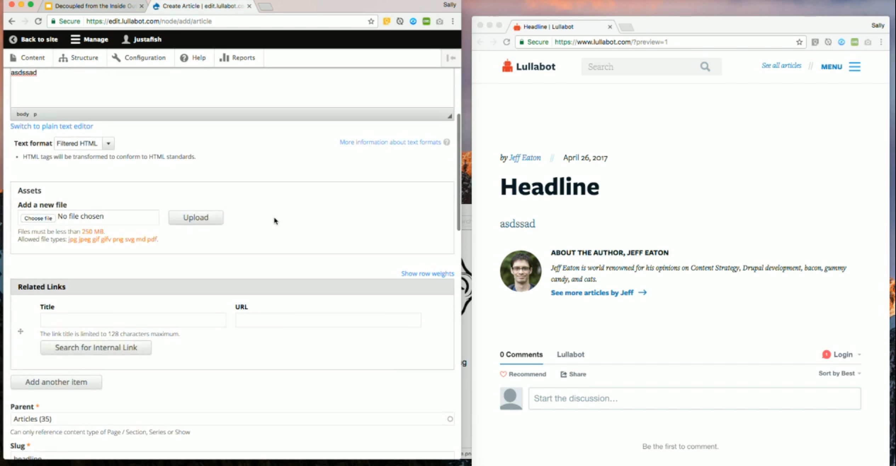

# Decoupled from the Inside Out

> Based on [Decoupled from the Inside Out by Lullabot](https://www.youtube.com/watch?v=KF9gG_bkUDo)

## What open-source CMSes are doing?
### Calypso
** Pros **
    * It’s WordPress
    * It’s very fast
    * Work with react application
    * You can organise multiple site
** Cons**
    * The content is available it’s pretty simple

### Keystone
**Pros**
    * It has field api similar to Drupal
    * It’s node modules
**Cons**
    * You have to configure the set up manual (copy and paste)
    * Create directories manual
    * Don’t support relational database

### Django CMS
** Pros**
* Any kind of configuration done on CMS they are want to be available to do it in its architecture
* You can have a REACT app
** Cons**
* Few contributors to the API

## Drupal headless CMSes
> ** You have to pay **
The most populares are:

* contentful
* prismic.io
* Back&
* built.io
* Kentico Cloud (Most similar to Drupal)
* kinky

However **Drupal is API** open source, you don’t have to pay any money

> Drupal headless is powerful

## What’s difficult when decoupling Drupal
There are many point challenges 
* API documentation poor
* There are no resources available for many modules (documentation)
* If you work with REACT or any other front-end framework you define your route on your app
* There is no rules for set up. It’s very different for every single project, **this can be very tricky**

## Internally decoupled in Drupal

One of the things that would be nice is:
* Build sites that we don’t need to theme necessarily 
* We could pretend to build single page application with allows people to any field UI
* Have a drupal like a package
* Have a JSON file