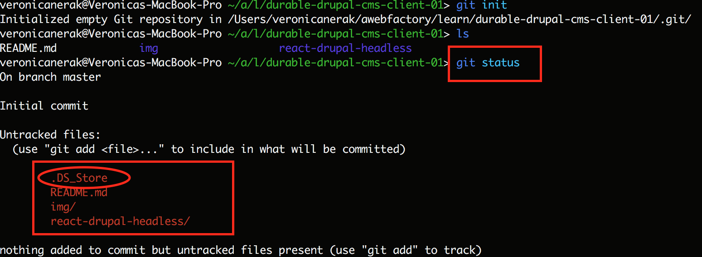
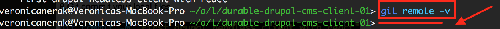
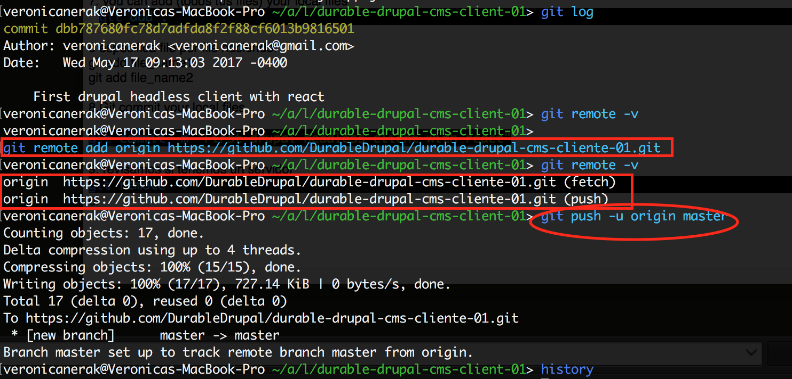

# How to sync local git repo to already existing remote

Follow the following steps:

## 1. Create your local repo
* Create your local folder

`mkdir local-name-repo`

* Initialize the local repo
In order to initialize your local repo run:
`git init`

* See the status:
`git status`

This command allows you to see the files status, see the image below:

* You will see all files. If there are files that you don't need to add into the repo for example:
`.DS_Store`
* Create the file `.gitignore` and add it with:
    * `echo ".DS_Store" > .gitignore`
* In order to see the content of `.gitignore` file. Run:
    * `cat .gitignore`

In this file you can add all files and extensions that they don't need to be part of the repo

## 2. Adding files into your local repo
First of all we have to add files:

* `git add .`  In order to add all files
* `git add file-name`  In order to add a file

* Once files are added you can commit them:
    * `git commit -m "Please write a comment"`

## 3. Sync your local git repo to already existing remote
* If you execute:
`git remote -v`
We can see that our local repo doesn't have any repo associated

* In order to sync our local repo to remote. Run:
`git remote add remote-path`

For example:

`git remote add origin https://github.com/DurableDrupal/durable-drupal-cms-cliente-01.git`

* Now we can see our remote repo. Running:
`git remote -v`

>origin  https://github.com/DurableDrupal/durable-drupal-cms-cliente-01.git (fetch)

>origin  https://github.com/DurableDrupal/durable-drupal-cms-cliente-01.git (push)

## 4. Pushing into remote repo

As a summary until now we performed:

* Added files: `git add file-name`

* Commited them `git commit -m "some comment"`

Now all files added are ready to push into that remote repo:
`git push -u origin master`
Where:
> "u" means upstream (from our local repo to remote)

* Next times we just need to push our files running:

`git push` or `git push origin master`
because we have already defined the repo.

* Done

